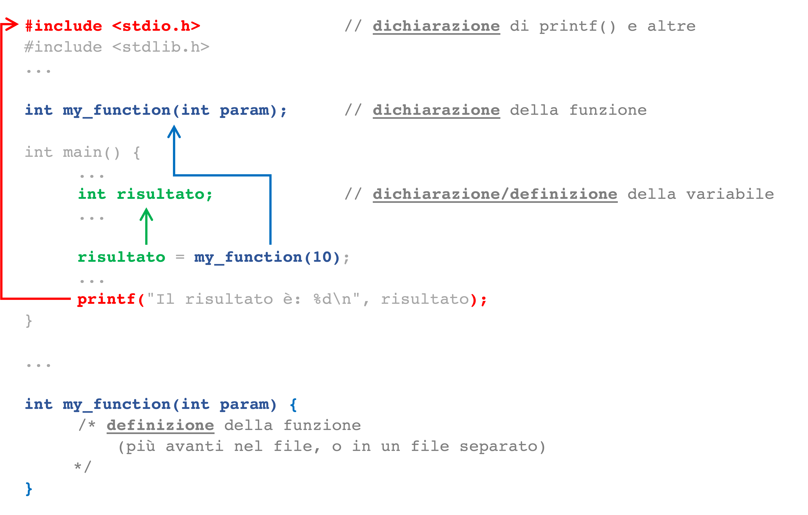
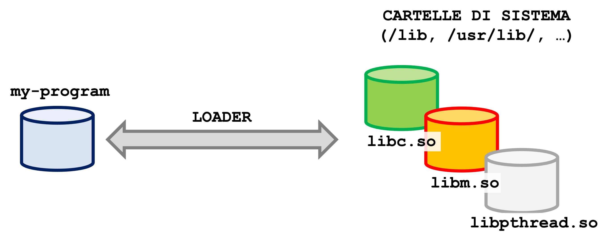

# Errori di programmazione comuni

## Dichiarazioni

Nel linguaggio C, prima che una variabile o funzione sia usata nel programma, deve essere **preceduta da una dichiarazione**. La dichiarazione indica il tipo della variabile, o il tipo dei parametri per le funzioni.



Se si omette la dichiarazione, il compilatore segnalerà un errore. L'errore indicherà la riga in cui la variabile/funzione viene usata per la prima volta (senza essere stata prima dichiarata).


Nel caso delle funzioni, è necessario anche fornire la **definizione** del codice della funzione. La definizione può essere scritta in qualunque parte del programma (anche in un file separato).

Nel caso delle variabili locali, non è necessaria una definizione (la dichiarazione funge anche da definizione). Nel caso delle variabili globali, è necessario distinguere tra dichiarazione e definizione, come sarà spiegato più avanti.

**Esercizio**: Risolvere il [programma con errori di dichiarazione, nella cartella "1-declarations/"](1-declarations)


## Sintassi

Il compilatore legge, una alla volta, le parole nel programma (dette "token"). Il compilatore controlla che le parole rispettino le regole del linguaggio di programmazione.

Quando si inizia a leggere un file, il compilatore si aspetta una dichiarazione (di variabile, funzione, tipo, etc.). All'interno delle definizioni delle funzioni (ad esempio `main`), il compilatore si aspetta istruzioni di assegnazione, cicli, etc.

Considera il seguente esempio:


Il compilatore vede il programma come la seguente sequenza di token. Il compilatore legge inizialmente le parole `void`, poi `prova`, e poi la parentesi `(`. Conclude che il programma sta dichiarando una funzione. Da questo punto in poi, si aspetta una dichiarazione di uno o più parametri (es. `int parametro`), e poi la parentesi `)`.

Dalla presenza della parentesi `{`, il compilatore conclude che la dichiarazione è seguita dalla definizione della funzione. Al suo interno troverà due assegnazioni e una chiamata alla funzione `printf`.


Nel caso che i token non rispettino le regole del linguaggio, il compilatore segnala un errore. Ad esempio, ogni parentesi `(` deve essere accoppiata a una parentesi `)`, ed ogni istruzione deve terminare con il punto e virgola `;`.


**Esercizio**: Risolvere il [programma con errori di sintassi, nella cartella "2-syntax/"](2-syntax)


## Pre-processore

Il pre-processore è un software che viene chiamato dal compilatore **prima** di compilare un programma. Sostituisce le istruzioni che iniziano con `#` (es. `#include`, `#define`, etc.) con altro testo.

È analogo ad una **operazione di copia-incolla**!


Occorre prestare attenzione alla corretta sintassi delle istruzioni del preprocessore. Ad esempio, il corretto uso degli spazi, parentesi e punteggiatura in `#define`. Questi errori sono difficili da risolvere: il messaggio di errore del compilatore non mostra il codice originale (es. la macro `N`), ma il codice pre-processato (ossia il valore `100`)!

**Esercizio**: Risolvere il [programma con errore nelle direttive al pre-processore, nella cartella "3-preprocessor/"](3-preprocessor)


## Linking

I programmi in C sono tipicamente suddivisi su più file (nell'esempio, `main.c` e `funzioni.c`).

Un file può usare una variabile o una funzione che sono definite in un altro file. Il file utilizzatore (ad esempio `main.c`) deve almeno includere una dichiarazione delle variabili e funzioni esterne al file, precedute dalla parola `extern`.


Il compilatore elabora `main.c`, senza sollevare errori per le variabili e le funzioni esterne (pur non essendo state definite).

Nella fase di collegamento, il *linker* controllerà che le variabili e funzioni esterne usate in `main.o` siano state definite in un altro file (`funzioni.o`).


È buona norma che le definizioni siano inserite in un file "header", da includere in tutti gli altri file che usano quelle variabili o funzioni.

- *nota 1*: la parola `extern` è opzionale per le funzioni

- *nota 2*: il file header viene incluso anche in `funzioni.c` dove ci sono le definizioni. Questa inclusione non è strettamente necessaria, ma è utile. Quando il compilatore elabora `funzioni.c`, esso controllerà che le dichiarazioni siano coerenti con le definizioni (ad esempio, evita errori di distrazione nel file header).


**Esercizio**: Risolvere il [programma con errore in fase di linking, nella cartella "4-linking/"](4-linking)


## Librerie dinamiche

Il sistema operativo consente di posticipare il linking delle librerie a quando il programma verrà eseguito.

Ad esempio, le funzioni dello standard C (`printf`, `strcat`, `malloc`, e altre) sono incluse nella "libreria standard" (`libc`) che viene collegata al momento del caricamento del programma. La libreria PThreads (`libpthread`) è un altro esempio che sarà usato nel corso.



Per predisporre il caricamento delle librerie dinamiche, è necessario compilare il programma con l'opzione `-l` seguito dal suffisso del nome della libreria (es. `-lssl` per la libreria `libssl`). Fa eccezione la libreria `libc`, che è di default sempre collegata dinamicamente.

**Esercizio**: Risolvere il [programma con errore nell'uso di librerie dinamiche, nella cartella "5-lib/"](5-lib). Consultare il manuale della funzione `sqrt` per determinare quale libreria è necessaria, e correggere il `Makefile`.


## Segmentation Fault

Anche se il programma compila correttamente, è possibile che si verifichino errori durante l'esecuzione. Un errore frequente è l'utilizzo errato dei puntatori: il programma legge/scrive in memoria usando un puntatore che contiene un indirizzo di memoria errato. In questo caso, la CPU solleva una eccezione (es. "indirizzo illegale"), che il sistema operativo gestisce "uccidendo" il processo.

Il seguente esempio è un caso di puntatore non usato correttamente.


L'esecuzione del programma termina forzatamente, e la shell mostra il messaggio *"Errore di segmentazione"* (*"Segmentation Fault"*).

```
$ gcc -o pointer pointer.c
$ ./pointer
Errore di segmentazione
```

I seguenti esempi sono casi di corretto utilizzo dei puntatori.

Uso di `malloc()`.


Altro uso di `malloc()`, preceduto da NULL.


Passaggio di parametri tramite puntatore.


Per diagnosticare la causa di un *Segmentation Fault*, è necessario raccogliere più informazioni dal sistema operativo. È possibile abilitare il salvataggio della memoria del processo (*"core dump"*) al momento della terminazione. Con un debugger, è possibile aprire il core dump e leggere le informazioni sulle cause della terminazione. In particolare, si potrà conoscere quale è l'istruzione del programma che ha fatto uso di un puntatore con indirizzo invalido.

- Passo 1: Ricompilare il programma per abilitare le informazioni di debugging (aggiungere opzione `-g`).

```
$ gcc -g -o pointer pointer.c
```

- Passo 2: Abilitare il salvataggio dei core dump.
```
$ sudo bash -c 'echo core > /proc/sys/kernel/core_pattern'
$ ulimit -c unlimited 
```

- Passo 3: Eseguire il programma, e riprodurre il malfunzionamento.
```
$ ./pointer
Errore di segmentazione (core dump creato)
```

- Passo 4: Nella cartella corrente apparirà un file di nome `core.12345`. Il numero rappresenta il PID del processo terminato. Aprire il file con il debugger (`gdb`).
```
$ gdb -c core.12345 ./pointer
(gdb)
````

- Passo 5: La stringa `(gdb)` (prompt) indica che il debugger è in attesa di direttive. Digitare il comando `bt` (backtrace) seguito da INVIO. Questo comanndo stampa la funzione in esecuzione al momento della terminazione. Inoltre, stampa la lista delle funzioni chiamanti.
```
(gdb) bt
#0  0x000055970fe27159 in main () at pointer.c:7
#1  0x00007f134da3cd90 in __libc_start_call_main (main=main@entry=0x55970fe27149 <main>, argc=argc@entry=1, argv=argv@entry=0x7ffddd9d5078) at ../sysdeps/nptl/libc_start_call_main.h:58
#2  0x00007f134da3ce40 in __libc_start_main_impl (main=0x55970fe27149 <main>, argc=1, argv=0x7ffddd9d5078, init=<optimized out>, fini=<optimized out>, rtld_fini=<optimized out>, stack_end=0x7ffddd9d5068) at ../csu/libc-start.c:392
#3  0x000055970fe27085 in _start ()
```

Il programma è terminato alla linea 7 del file `pointer.c`. La linea si trova all'interno della funzione `main()`. Si ignorino le funzioni elencate subito dopo il `main()`.

- Passo 6: Digitare `quit` e INVIO per chiudere il debugger
```
(gdb) quit
$
```


**Esercizio**: Risolvere il [programma con errore in fase di esecuzione, nella cartella "6-segmentation-fault/"](6-segmentation-fault). Si utilizzi il debugger per risalire al puntatore che causa il malfunzionamento.


## Crediti

Esempi tratti da:
* https://github.com/portfoliocourses/c-example-code
* https://github.com/TheAlgorithms/C/
